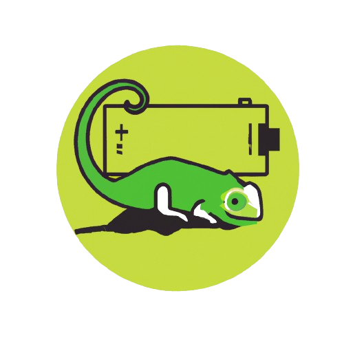

<!-- Improved compatibility of back to top link: See: https://github.com/othneildrew/Best-README-Template/pull/73 -->
<a name="ADOK BATTERY"></a>
<!--  
*** Thanks for checking out the Best-README-Template. If you have a suggestion
*** that would make this better, please fork the repo and create a pull request
*** or simply open an issue with the tag "enhancement".
*** Don't forget to give the project a star!
*** Thanks again! Now go create something AMAZING! :D
-->. 


<!-- PROJECT SHIELDS -->
<!--
*** I'm using markdown "reference style" links for readability.
*** Reference links are enclosed in brackets [ ] instead of parentheses ( ).
*** See the bottom of this document for the declaration of the reference variables
*** for contributors-url, forks-url, etc. This is an optional, concise syntax you may use.
*** https://www.markdownguide.org/basic-syntax/#reference-style-links
-->
[![MIT License][license-shield]][license-url]
[![LinkedIn][linkedin-shield]][linkedin-url]


<!-- PROJECT LOGO -->
<br />
<div align="center">
  <a href="https://github.com/Agfiras/Battery-Driver_Hub/">
    
  </a>
  <h3 align="center">ADOK BATTERY</h3> <br>
  <p align="center">
    A solution to get Real-time informations of the battery's Hub
    <br>
   and project it in Windows
    <br />
    <a href="https://github.com/Agfiras/Battery-Driver_Hub/blob/main/Logos/Screenshot.gif">View Demo ➡️</a>
  </p>
</div>


<!-- TABLE OF CONTENTS -->
<details>
  <summary><strong>Table of Contents</strong></summary>
  <ol>
    <li>
      <a href="#about-the-project">About The Project</a>
      <ul>
        <li><a href="#built-with">Built With</a></li>
        <li><a href="#Project-Structure">Project Structure</a></li>
      </ul>
    </li>
    <li>
      <a href="#how-to-test">How to test</a>
      <ul>
        <li><a href="#prerequisites">Prerequisites</a></li>
        <li><a href="#test-instruction">Test instruction</a></li>
      </ul>
    </li>
    <li><a href="#license">License</a></li>
    <li><a href="#acknowledgments">Acknowledgments</a></li>
  </ol>
</details>


<!-- ABOUT THE PROJECT -->
## About The Project

<p>ADOK BATTERY is an executable designed to interface with the Simbat driver to extract battery information via a COM Express board using the CGOS library. This program updates parameters such as battery <strong>capacity</strong>, <strong>rate</strong>, and <strong>power state</strong>, ensuring synchronized and accurate representation of the battery status within the Windows system.</p>


### Built With
This Project is developed mainly with two languages , the excutable with C++ and th driver with C.
* [![C][C.js]][C-url]
* [![C++][C++.js]][C++-url]
<br> </br>
Optimized for the Windows x64 Environment using the Microsoft Visual Studio Integrated Development Environment (IDE).
* ![Windows][Windows.js]
* [![VisualStudio][Visual Studio.js]][Visual Studio-url]
  

### Project Structure

- **main.cpp**:
  - Entry point for the application.
  - Contains the main loop for continuous monitoring of battery status.
  - Initializes the service through the `wWinMain` function.

- **BatteryService.hpp**: 
  - Defines the `CBatteryService` class.
  - Inherits from `CServiceBase` to manage Windows service events.
  - Methods to start, stop, and handle service interruptions.

- **BatteryService.cpp**:
  - Implements the methods defined in `BatteryService.hpp`.
  - Includes the logic for starting and stopping the service.
  - Contains the service worker thread (`ServiceWorkerThread`) for continuous monitoring.

- **Battery.hpp**:
  - Defines the `BatteryStausWrap` class.
  - Methods for interacting with the battery, including retrieving the charge percentage and determining if the battery is powered.
  - Declaration of the `ReadBatInfo` function for reading information via I2C.

- **Battery.cpp**:
  - Implements the methods from `Battery.hpp`.
  - Manages I2C communication with the battery.
  - Converts raw data into readable information (e.g., percentage, power status).

- **DeviceInstance.hpp**:
  - Defines the `DeviceInstance` class.
  - Provides methods to retrieve specific information about a device (e.g., driver version).

- **DeviceInstance.cpp**:
  - Implements methods for interacting with device instances.
  - Accesses the PDO path, driver version, and other device metadata.
  

## How to test
It's recommended to **test in a Adok HUB** during development, since faulty drivers might crash or corrupt the computer and it will crash since the computer do not run with COM Express board. You can use the "checkpoint" feature to roll back the machine to a known good state in case of driver installations problems.

### Prerequisites

For the **host** computer:
- Install [Visual Studio](https://visualstudio.microsoft.com/).
- Install [Windows Driver Kit (WDK)](https://learn.microsoft.com/en-us/windows-hardware/drivers/download-the-wdk).

For the **target HUB**:
- Disable Secure Boot in UEFI/BIOS.
- Enable test-signed drivers: [`bcdedit /set testsigning on`](https://learn.microsoft.com/en-us/windows-hardware/drivers/install/the-testsigning-boot-configuration-option).
- (Optional) Enable kernel debugging: `bcdedit /debug on`.

### Test instruction
Use the driver to **simulate battery behavior** on Windows.

Steps:
* Build solution in Visual Studio or download binaries from [releases](../../releases).
* Run `INSTALL.bat` with admin privileges to install the driver a simulated batterie.
* Run the following command in an elevated command prompt to install the service: 
  ```sh
   sc create BatteryService binPath= "C:\path\to\your\BatteryConfig.exe"
* Run this command to start the Service :
  ```sh
  `sc start BatteryService`
* Reboot.
* Run `UNINSTALL.bat` with admin privileges to uninstall the driver and delete simulated batterie.
* Run this to stop and delete the service: `sc stop BatteryService` then `sc delete BatteryService`

### Troubleshooting
- **Error LNK2019: Unresolved external symbol WinMain:**
   - Ensure the entry point is correctly defined as wWinMain in `main.cpp`.
   - Verify that the project subsystem is set to Windows (not Console).
- **Error LNK2005: Function already defined:**
   - Check for multiple definitions of the same function in different files.
   - Use include guards in header files to prevent multiple inclusions.

<!-- LICENSE -->
## License

Distributed under the MIT License. See [`LICENSE.txt`](https://github.com/my-adok/APP-BatteryDriver/blob/main/LICENSE.txt) for more information.


<!-- ACKNOWLEDGMENTS -->
## Acknowledgments

I've included a few of my favorites to kick things off!

* [Writing Battery Miniclass Drivers](https://learn.microsoft.com/en-us/windows-hardware/drivers/battery/writing-battery-miniclass-drivers)
* [Cgos Documentation](https://github.com/Agfiras/Battery-Driver_Hub/blob/main/Logos/Cgos.pdf)


<!-- MARKDOWN LINKS & IMAGES -->
<!-- https://www.markdownguide.org/basic-syntax/#reference-style-links -->

[license-shield]: https://img.shields.io/github/license/othneildrew/Best-README-Template.svg?style=for-the-badge
[license-url]: https://github.com/my-adok/APP-BatteryDriver/blob/main/LICENSE
[linkedin-shield]: https://img.shields.io/badge/LinkedIn-0077B5?style=for-the-badge&logo=linkedin&logoColor=white
[linkedin-url]: https://www.linkedin.com/in/firas-ajengui
[C.js]: https://img.shields.io/badge/C-00599C?style=for-the-badge&logo=c&logoColor=whit
[C-url]: https://learn.microsoft.com/en-us/cpp/c-language/?view=msvc-170
[C++.js]: https://img.shields.io/badge/C%2B%2B-00599C?style=for-the-badge&logo=c%2B%2B&logoColor=white
[C++-url]: https://isocpp.org/
[Windows.js]: https://img.shields.io/badge/Windows-0078D6?style=for-the-badge&logo=windows&logoColor=white
[Visual Studio.js]: https://img.shields.io/badge/Visual_Studio-5C2D91?style=for-the-badge&logo=visual%20studio&logoColor=white
[Visual Studio-url]: https://visualstudio.microsoft.com/fr/downloads/

